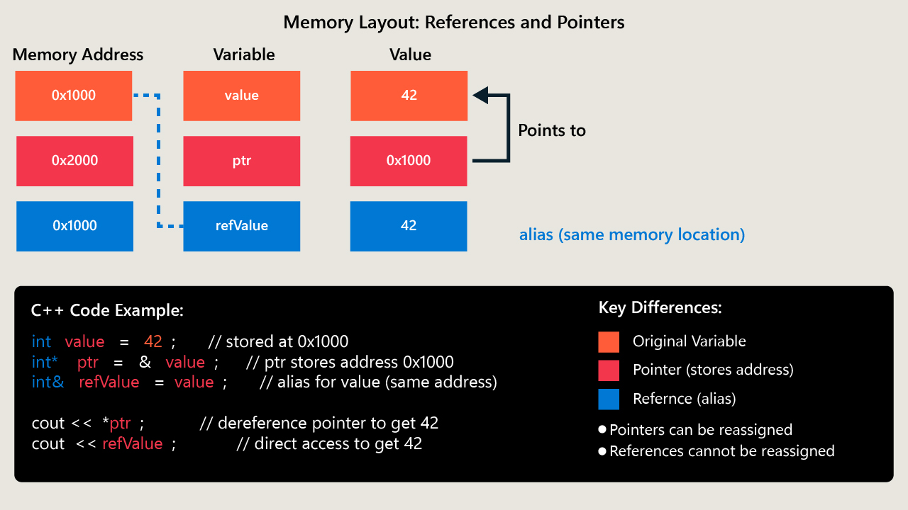

# Reference Semantics, Pointer Operations, and Memory Addressing

## Introduction

Imagine gaining the power to control exactly where your data lives and how it's accessed. That's what understanding references, pointers, and memory addressing unlocks in the world of C++ programming. These concepts are the blueprints that architects of high-performance systems like game engines and operating systems rely on to sculpt their masterpieces. Today, we examine these constructs—reference semantics, pointer operations, and memory addressing—laying out their roles and applications within C++ programming.

---

## Reference Semantics

### What Are References?

In C++, a reference is essentially another name for an existing variable. This ability to alias variables allows for efficient data management, particularly for large objects, by circumventing the need for duplication. Once established, a reference remains immutable and guarantees safe, straightforward usage.

### Declaration and Initialization

References are declared by placing an `&` (ampersand) next to the data type. To illustrate:

```cpp
int value = 10;
int& refValue = value;
```

Here, `refValue` acts as a twin to `value`. Changing `refValue` affects `value` directly and vice versa, thus enabling efficient modifications, especially utilized in function calls:

```cpp
void modifyValue(int& input) {
    input += 5;
}

int main() {
    int number = 20;
    modifyValue(number); 
    /* 'number' is now 25. A regular variable would allow a change within the function,
       however, the original number in main would retain the value of 20 */
}
```

In scenarios like these, references prevent the slow copying of larger data structures, making your applications smooth and responsive.

---

## Pointer Operations

### Understanding Pointers

Pointers empower programmers with versatile control over memory. They store the address of another variable, providing vast capabilities for direct data manipulation.

### Declaration and Syntax

Declaring a pointer is accomplished with the `*` (asterisk) symbol:

```cpp
int number = 100;
int* ptr = &number;
```

Here, `ptr` is given the address of `number` through the `&` operator. If you wish to access the memory location's content, the `*` operator (used to dereference) steps in:

```cpp
cout << *ptr; // Outputs: 100
*ptr += 50;
cout << number; // Outputs: 150
```

### Pointer Arithmetic

Pointers cater to arithmetic operations, such as incrementing for traversing arrays—a crucial task in efficiently processing collections:

```cpp
int arr[3] = {1, 2, 3};
int* ptr = arr;

cout << *ptr; // Outputs: 1
ptr++;
cout << *ptr; // Outputs: 2
```

By advancing the pointer, you can navigate seamlessly through contiguous memory blocks.

---

## Memory Addressing

### How Memory Addressing Works

C++ allows a program's data to be stored in memory locations, each marked by its unique address, akin to a building address in a city. Proper memory management directly influences software performance and reliability.

### Memory Indirection

Through memory indirection, pointers work with memory addresses to enable granular control and manipulation of resources. This type of access is instrumental in crafting finely-tuned applications where resources are precious, and optimization is key.

---

## References vs. Pointers

Both references and pointers manipulate variable memory, yet they tout unique benefits:

* **References**

  * Stable and user-friendly
  * Must be initialized at declaration
  * Ideal for parameter passing without pointer complexity

* **Pointers**

  * Highly flexible
  * Can be reassigned or set to `nullptr`
  * Require careful handling to avoid memory leaks or dangling pointers

---

## Practical Applications

### References for Efficiency

When calling functions, references provide a means to optimize performance by circumventing unnecessary data duplication:

```cpp
void printBookDetails(const Book& book) {
    cout << book.title << " by " << book.author;
}
```

### Pointers for Control

In situations requiring dynamic memory control—like complex data structures—pointers shine:

```cpp
Student* studentPtr = new Student("John", 1234);

delete studentPtr; // Efficient memory management
```

---

## Memory Diagram Visualization

Understanding references and pointers can be enhanced by diagrams that illustrate how these elements interact within memory:

> *C++ memory diagram illustrating differences between variables, pointers, and references with code examples.*



This visual aid helps clarify the landscape of memory addressing, reinforcing your understanding of how references and pointers are utilized.

---

## Conclusion

By mastering references, pointers, and memory addressing, you've taken a significant step in wielding the full capabilities of C++. These fundamentals form the groundwork for crafting blazing-fast, memory-efficient applications, whether that involves optimizing game engines or stabilizing operating systems. As you implement these skills, you pave the way to becoming adept in developing robust, high-performance software—an invaluable skill in today's tech-driven world. Keep experimenting and refining your techniques, ensuring that your applications not only function seamlessly but also utilize memory responsibly and effectively.
